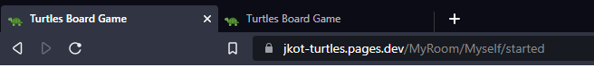
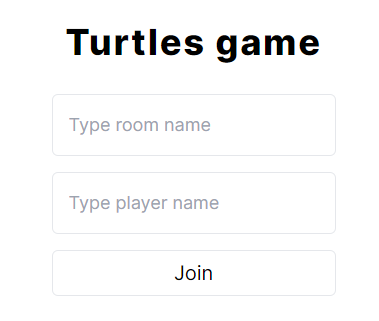
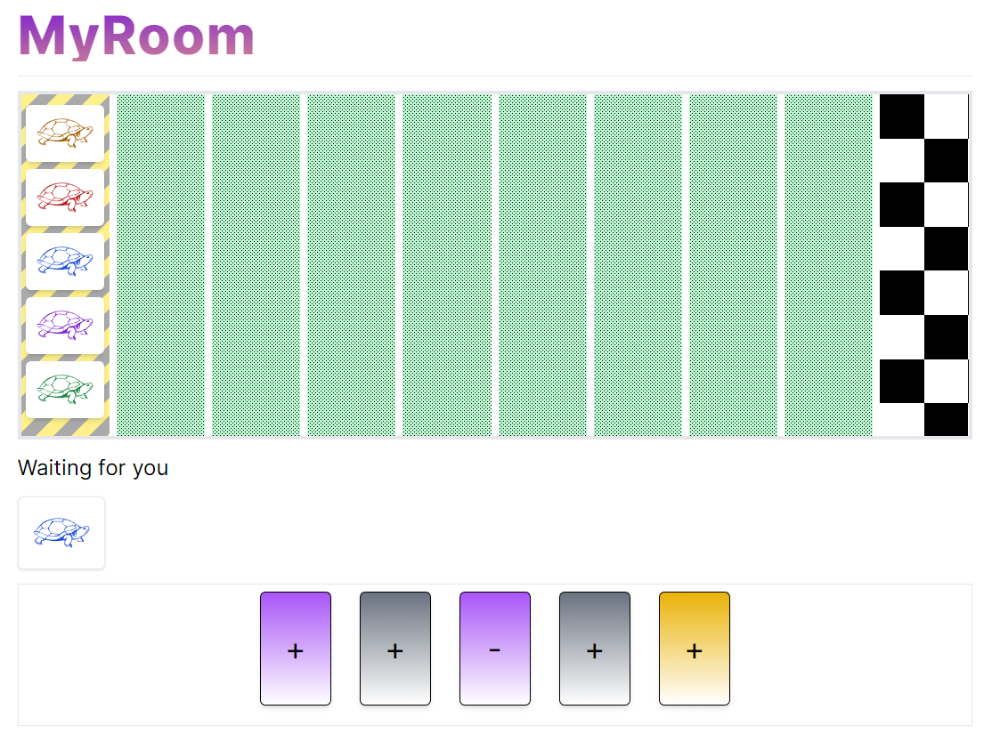
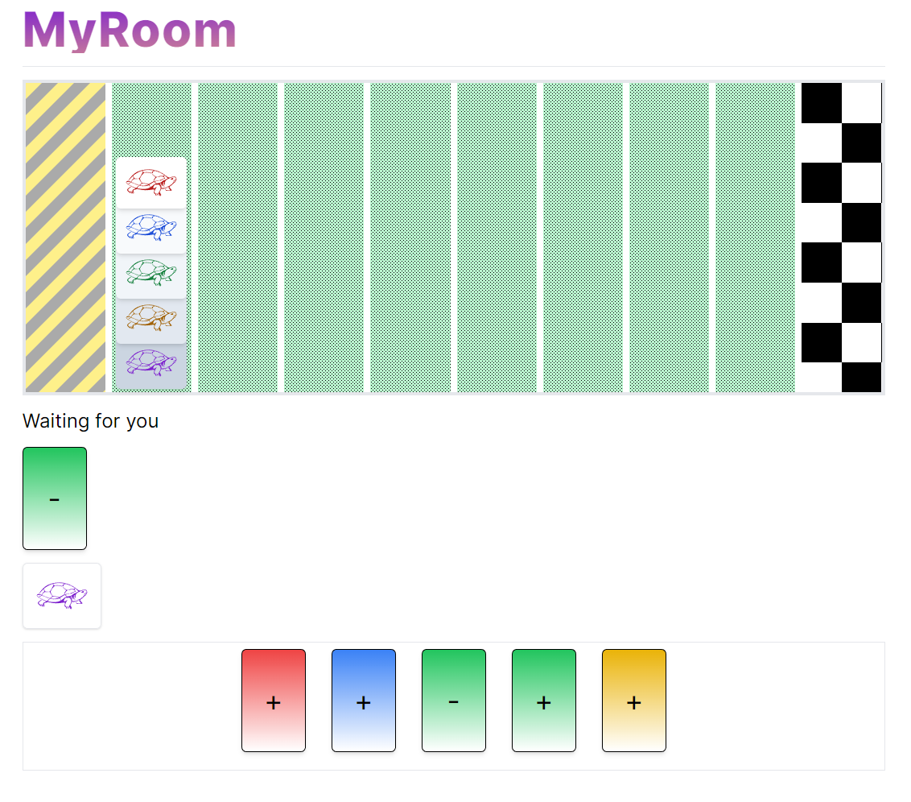

# The turtles board game

This is a small project that utilizes [React](https://reactjs.org/), [Remix](https://remix.run/) and [Cloudflare workers](https://workers.cloudflare.com/) (With [Durable Objects](https://developers.cloudflare.com/workers/learning/using-durable-objects/#:~:text=Durable%20Objects%20are%20named%20instances,link%20%3E%20Workers%20%3E%20Durable%20Objects.) and [WebSockets](https://developers.cloudflare.com/workers/learning/using-websockets/))

## Trying things out

You can try out the game at [https://jkot-turtles.pages.dev/](https://jkot-turtles.pages.dev/). However, since it requires a minimum of two players, you'll have to either _get friends_ or open up another tab and join the same room.



## Technical Description

All the game logic and the server is built using Cloudflare workers. I set it up so that you can connect and communicate through WebSockets to the Cloudflare worker through a simple messaging structure. I send tuples with a type as the first item and then the data as the second.

```ts
export type ServerMessage =
  | ["error", string]
  | ["starting"]
  | [
      "started",
      { board: Tile[]; player: Player; turn: string; played: Card | undefined }
    ]
  | ["waiting", string[]]
  | ["reconnected", string]
  | ["joined", string]
  | ["cards", Card[]]
  | ["played", { board: Tile[]; card: Card; turn: string }]
  | ["done", { board: Tile[]; winners: Winner[] }];
```

I only use the Cloudflare worker for its Durable Objects, and more specifically I use the WebSocket feature of it. There's no persistent storage on the server side and a given game will be evicted when the durable object gets evicted.

The web application is built using Remix, and in turn React. Because both code-bases are built using TypeScript I reuse the type from the Cloudflare worker in the web application, which has been very helpful.

## Game rules

The goal of the game is to get your turtle to the finish line first, however if several turtles end up on the finishing line at the same time the turtle that is the farthest down in the stack wins. If only turtles not owned by any player reaches the finishing line then the game goes on as normal.

At the beginning of each game every player is given a turtle color and a hand of five cards. This color is not to be shared with the other players.

On each turn a player plays a card to move a turtle. There possible card variations are as follows.

- `[turtle_color]+`
- `[turtle_color]++`
- `[turtle_color]-`
- `any+`
- `any-`
- `any↑`
- `any↑↑`

The symbols have the following meaning.

- `+` means one move forward
- `++` means two moves forward
- `-` means one step backwards
- `↑` means any turtle that is in last place gets to move one step forward
- `↑↑` means that any turtle in last place gets to move forward twice.

The twist is that when you move a turtle, you also move every turtle that is currently stacked on top of you. The only exception to this rule is the starting tile where no turtle is considered stacked on top of another.

## Why Cloudflare workers?

I've been playing around with a lot of Cloudflare lately, and I'm frankly fascinated with their Cloudflare workers. They're small, light weight and seems like a great tool to build any user per-user functionality. I use the same techniques to build my blog over at [https://jkot.me/](https://jkot.me/). I just want to learn more and get more use out of the durable objects.

## Why Remix?

The whole web application is completely client-based, so this didn't _need_ to be made in Remix. It's just that my previous project was made in Remix and I really appreciate the ease you can create routes from the file structure.

## Screenshots




